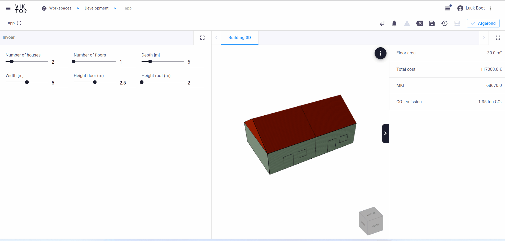

:::note
Estimated time: 30 minutes <br/>
Difficulty level: Beginner
:::

## Introduction 
Welcome to this tutorial on integrating Dynamo with VIKTOR! VIKTOR is a platform dedicated to the Engineering and Construction industry, providing a seamless integration with 3rd party software. In this tutorial, we will explore how to render a basic house with Dynamo and visualize it in VIKTOR. To get started, the user will provide parameters such as the number of houses, width, depth, number of floors, and heights for floors and roofs. The VIKTOR worker will then compute the Dynamo model using the command-line interface included within Dynamo Sandbox. The geometry of the model is generated using either Autodesk Revit or FormIt. The geometry JSON is then converted to a mesh, which is rendered and visualized in VIKTOR. In this tutorial, we will cover the step-by-step process of setting up a VIKTOR app with Dynamo integration we will cover:

- [Setup VIKTOR app](#1-Setup-a-VIKTOR-app)
- [Create a method to update Dynamo file](#2-Create-a-method-to-update-Dynamo-file)
- [Create a mocked GeometryView](#3-Create-a-GeometryView-with-mocked-ouput-files)
- [Create a data processing method](#4-Create-a-data-processing-method)
- [Create a Data View with the mocked output files](#5-Create-a-DataView-with-mocked-ouput-files)
- [Create a GeometryAndDataView with the mocked output files](#6-Create-a GeometryAndDataView-with-the-mocked-output-file)
- [Add the worker logic to supply](#7-Add-the-worker-logic-to-supply-the-real-output-files)
- [Setting up worker](#8-Setting-up-worker)

By the end of this tutorial, you will have created a simple VIKTOR application that creates a geometry and data view of a simple house, see GIF below:



So, let's get started and learn how to create amazing 3D models in Viktor using Python!

:::tip
You can find the complete code [below](#All-code-together:)
:::

## Pre-requisites

:::note Prerequisites
- You completed [Create your first app](/docs/getting-started/create-first-app) section.
- You have some experience with reading Python code
- You have downloaded the Dynamo file
:::

During the tutorial, we added some links to additional information; but don't let them distract you too much. Stay
focused on completing the tutorial. After this, you will know everything you need to create an app which includes integrating with Dynamo.


## 1 Setup a VIKTOR app 

### Create an empty app

Let’s first create and start an empty app. If you don't remember how this worked you can check out the first few steps 
of the [Create your first app](/docs/getting-started/create-first-app) tutorial. Make sure to give you app a recognisable 
name, like "3d-models-tutorial".

Here a short summary of the process.

 ```bash
# Create an empty editor-type app
> viktor-cli create-app my-Dynamo-app --app-type editor
# Navigate to the app directory and install the app
> cd my-Dynamo-app
> viktor-cli install
# Clear your database just to be sure
> viktor-cli clear
# And start the app!
> viktor-cli start
 ```

:::caution
Please be aware that the `create-app` function sets the newly created app to use the latest [SDK-version](/docs/create-apps/fundamentals/upgrade-viktor-version)
While this tutorial was written using SDK version 14.0.0.
:::

### Add inputfields 
We will add 6 inputfields to our app: `number_of_houses`, `number_of_floors`, `depth`, `width`, `height_floor` and `height_roof`. We will use [Numberfield]( /sdk/api/parametrization#_NumberField),  for this.

1. Open `app.py`, and add the relavant field to your parametrization. If you like you could accompany the fields with some instructive text. Don't forget to import the necessary fields. In the end your `app.py` file should look like this:


```python showLineNumbers
from viktor import ViktorController
from viktor.parametrization import ViktorParametrization
from viktor.parametrization import NumberField
from viktor.parametrization import Text

class Parametrization(ViktorParametrization):
    intro = Text("# 3D  Dynamo app \n This app parametrically generates and visualises a 3D model of a house using a Dynamo script. \n\n Please fill in the following parameters:")
    
    # Input fields
    number_of_houses = NumberField("Number of houses", max=8.0, min=1.0, variant='slider', step=1.0, default=3.0)
    number_of_floors = NumberField("Number of floors", max=5.0, min=1.0, variant='slider', step=1.0, default=2.0)
    depth = NumberField("Depth [m]", max=10.0, min=5.0, variant='slider', step=1.0, default=8.0)
    width = NumberField("Width [m]", max=6.0, min=4.0, variant='slider', step=1.0, default=5.0)
    height_floor = NumberField("Height floor", max=3.0, min=2.0, variant='slider', step=0.1, default=2.5, suffix='m')
    height_roof = NumberField("Height roof", max=3.0, min=2.0, variant='slider', step=0.1, default=2.5, suffix='m')


class Controller(ViktorController):
    label = 'My Entity Type'
    parametrization = Parametrization
```

2.  Refresh your app, and you should see the input fields there.

## 2 Create a method to update Dynamo file 
In this chapter,  we will define the code to take the parameters as input, update the Dynamo file, and return the updated files. This will be done by creating a `staticmethod`  in the `Controller` class, similar to what is described in the [Generic integration](https://docs.VIKTOR.ai/docs/create-apps/software-integrations/Dynamo) section of the VIKTOR documentation.


The following code will update the nodes of the Dynamo file and generate an input file with the parameters from the parametrization class:

```python showLineNumbers

@staticmethod
def update_model(params) -> Tuple[File, DynamoFile]:
    """This method updates the nodes of the Dynamo file with the parameters
    from the parametrization class."""

    # First the path to the Dynamo file is specified and loaded
    file_path = Path(__file__).parent / "dynamo_model_sample_app.dyn"
    _file = File.from_path(file_path)
    dyn_file = DynamoFile(_file)

    # Update Dynamo file with parameters from user input
    dyn_file.update("Number of houses", params.number_of_houses)
    dyn_file.update("Number of floors", params.number_of_floors)
    dyn_file.update("Depth", params.depth)
    dyn_file.update("Width", params.width)
    dyn_file.update("Height floor", params.height_floor)
    dyn_file.update("Height roof", params.height_roof)

    # generate updated file
    input_file = dyn_file.generate()

    return input_file, dyn_file
```
Let us go through the above mentioned logic:
1. Retrieve the input files for the analysis, in this case the `dynamo_model_sample_app.dyn` file, and create a DynamoFile object instantiated from the `dynamo_model_sample_app.dyn` file.
2. With the update method, the value of input nodes can be updated.
3. When all inputs have been updated as desired, the generate method can be used to generate an updated [File](/sdk/api#_File) object.

:::Note
To create this method you will have to import different functions. See code below:

```python showLineNumbers
from pathlib import Path
from VIKTOR import File
from VIKTOR.external.dynamo import DynamoFile
```
:::


## 3 Create a GeometryView with mocked ouput files

In this chapter we will create a [GeometryView](/sdk/api/views#_GeometryView) to display the house. We will use a mocked output file for now, click [here] to download the json file. In chapter ... we will create the json file using the Dynamo script. 

To visualize the mocked output add a `GeometryView` method to your `Controller` class, see code below:


```python showLineNumbers
    @GeometryView("Mocked 3d model", duration_guess = 1)
    def mocked_geometry_view(self, params, **kwargs):
        # Step 1: Update model
        input_file, dynamo_file = self.update_model(params)

        # Step 2: Running analyses
        file_path = Path(__file__).parent / "Mocked_3d_model.json"
        _3d_file = File.from_path(file_path)

        # Step 3: Processing geometry
        glb_file = convert_geometry_to_glb(_3d_file)

        return GeometryResult(geometry=glb_file)

```

Let us go through the above mentioned logic:
1. Update the Dynamo file with the `update_model` method(see chapter 2)
2. For now we are using a mocked file, instead of running the analyses in Dynamo. The mocked file can be downloaded [here](). In chapter 7 it is explained how to create the json file using the Dynamo script.
3. With the helper function [convert_geometry_to_glb](/sdk/api/external/#_convert_geometry_to_glb), you can convert the json file to a GLB type file, which can directly be visualized in a `GeometryView`.
4. Refresh your app, and you should see a 3D model of a house.

:::note
To create this mtehod you will have to import different functions. See code below:

```python showLineNumbers
from viktor.external.dynamo import convert_geometry_to_glb
```
:::

## 4 Create a data processing method


In this chapter, we will define code to extract data from the dynamo file and output file. The dynamo file is used to get the node id, and the output.xml file is used to get the values. We will be creating another `staticmethod`  in the `Controller` class. See code below:


```python

@staticmethod
def convert_dynamo_file_to_data_items(input_file: DynamoFile, output_file: File) -> DataGroup:
    """Extracts the output of the Dynamo results by using the input and output files."""
    # Collect ids for the computational output from the Dynamo file (numerical output)
    output_id_floor_area = input_file.get_node_id("(OUTPUT) Floor area per house")
    output_id_total_cost = input_file.get_node_id("(OUTPUT) Total cost")
    output_id_mki = input_file.get_node_id("(OUTPUT) MKI")
    output_id_co2 = input_file.get_node_id("(OUTPUT) CO2")

    # Collect the numerical results from the output file using the collected ids
    with output_file.open_binary() as f:
        floor_area = get_dynamo_result(f, id_=output_id_floor_area)
        total_cost = get_dynamo_result(f, id_=output_id_total_cost)
        mki = get_dynamo_result(f, id_=output_id_mki)
        co2 = get_dynamo_result(f, id_=output_id_co2)

    # Add values to a structured data group
    data_group = DataGroup(
        DataItem(label="Floor area", value=round(float(floor_area), 2), suffix="m²"),
        DataItem(label="Total cost", value=round(float(total_cost), 2), suffix="€"),
        DataItem(label="MKI", value=round(float(mki), 2)),
        DataItem(label="CO₂ emission", value=round(float(co2), 2), suffix="ton CO₂"),
    )
    return data_group
```
Let us go through the above mentioned logic:
1. Get the node_id, which corresponds to the same node id as the input file.
2. Collect the numerical results.
3. We create a structured data group from the collected numerical results using the [DataGroup](/sdk/api/#_DataGroup) and [DataItem](/sdk/api/views#_DataItem) classes.

:::note
To create this method you will have to import different functions. See code below:

```python showLineNumbers
from viktor.external.dynamo import get_dynamo_result
```
:::

## 5. Create a DataView with mocked ouput files

In this chapter we will create a [DataView](/sdk/api/views#_DataView) to display the data. We will use a mocked output file for now. In chapter 7 we will create the xml file using the dynamo script.

To visualize the mocked output add a `DataView` method to your `Controller` class, see code below:

```python showLineNumbers
    @DataView("Mocked data results", duration_guess = 1)
    def mocked_data_view(self, params, **kwargs):
        # Step 1: Update model
        input_file, dynamo_file = self.update_model(params)

        # Step 2: Running analyses
        file_path = Path(__file__).parent / "Mocked_data_results.xml"
        _data_file = File.from_path(file_path)

        # Step 3: Process numerical output
        data_group = self.convert_dynamo_file_to_data_items(dynamo_file, _data_file)

        return DataResult(data=data_group)

```

Let us go through the above mentioned logic:Let us go through the above mentioned logic:
1. Update the Dynamo file with the `update_model` method(see chapter 1)
2. For now we are using a mocked file, instead of running the analyses in Dynamo. The mocked file can be downloaded [here](). 
3. With the static method `convert_dynamo_file_to_data_items`, you can convert the .xml file to a `Datagroup`, which can be directely visualized in `DataView`.
4. Refresh your app, and you should see a dataview with the data. 

## 6 Create a GeometryAndDataView with the mocked output files 
In this chapter we will combine the geometry view and data view in one view using the [GeometryAndDataView](/sdk/api/views#_GeometryAndDataView) class. We will use the mocked files. See the code we have so far below:

```python showLineNumbers
from typing import Tuple

from viktor import ViktorController
from viktor.parametrization import ViktorParametrization, NumberField
from viktor.views import GeometryAndDataView
from viktor.views import GeometryAndDataResult 
from viktor.views import DataItem
from viktor.views import DataGroup
from viktor.views import GeometryResult
from viktor.views import DataResult
from viktor.views import DataView
from viktor.views import GeometryView
from viktor.external.generic import GenericAnalysis
from viktor.external.dynamo import DynamoFile
from viktor.external.dynamo import get_dynamo_result
from viktor.external.dynamo import convert_geometry_to_glb
from viktor.core import File
from pathlib import Path


class Parametrization(ViktorParametrization):
    # Input fields
    number_of_houses = NumberField("Number of houses", max=8.0, min=1.0, variant='slider', step=1.0, default=3.0)
    number_of_floors = NumberField("Number of floors", max=5.0, min=1.0, variant='slider', step=1.0, default=2.0)
    depth = NumberField("Depth [m]", max=10.0, min=5.0, variant='slider', step=1.0, default=8.0)
    width = NumberField("Width [m]", max=6.0, min=4.0, variant='slider', step=1.0, default=5.0)
    height_floor = NumberField("Height floor", max=3.0, min=2.0, variant='slider', step=0.1, default=2.5, suffix='m')
    height_roof = NumberField("Height roof", max=3.0, min=2.0, variant='slider', step=0.1, default=2.5, suffix='m')


class Controller(ViktorController):
    viktor_enforce_field_constraints = True  # Resolves upgrade instruction https://docs.viktor.ai/sdk/upgrades#U83

    label = 'Residential Block'
    parametrization = Parametrization

    @staticmethod
    def update_model(params) -> Tuple[File, DynamoFile]:
        """This method updates the nodes of the Dynamo file with the parameters
        from the parametrization class."""

        # First the path to the Dynamo file is specified and loaded
        file_path = Path(__file__).parent / "dynamo_model_sample_app.dyn"
        _file = File.from_path(file_path)
        dyn_file = DynamoFile(_file)

        # Update Dynamo file with parameters from user input
        dyn_file.update("Number of houses", params.number_of_houses)
        dyn_file.update("Number of floors", params.number_of_floors)
        dyn_file.update("Depth", params.depth)
        dyn_file.update("Width", params.width)
        dyn_file.update("Height floor", params.height_floor)
        dyn_file.update("Height roof", params.height_roof)

        # generate updated file
        input_file = dyn_file.generate()

        return input_file, dyn_file


    @staticmethod
    def convert_dynamo_file_to_data_items(input_file: DynamoFile, output_file: File) -> DataGroup:
        """Extracts the output of the Dynamo results by using the input and output files."""
        # Collect ids for the computational output from the Dynamo file (numerical output)
        output_id_floor_area = input_file.get_node_id("(OUTPUT) Floor area per house")
        output_id_total_cost = input_file.get_node_id("(OUTPUT) Total cost")
        output_id_mki = input_file.get_node_id("(OUTPUT) MKI")
        output_id_co2 = input_file.get_node_id("(OUTPUT) CO2")

        # Collect the numerical results from the output file using the collected ids
        with output_file.open_binary() as f:
            floor_area = get_dynamo_result(f, id_=output_id_floor_area)
            total_cost = get_dynamo_result(f, id_=output_id_total_cost)
            mki = get_dynamo_result(f, id_=output_id_mki)
            co2 = get_dynamo_result(f, id_=output_id_co2)

        # Add values to a structured data group
        data_group = DataGroup(
            DataItem(label="Floor area", value=round(float(floor_area), 2), suffix="m²"),
            DataItem(label="Total cost", value=round(float(total_cost), 2), suffix="€"),
            DataItem(label="MKI", value=round(float(mki), 2)),
            DataItem(label="CO₂ emission", value=round(float(co2), 2), suffix="ton CO₂"),
        )
        return data_group


    @GeometryAndDataView("Mocked 3d/data", duration_guess=5)
    def geometry_and_data_view(self, params, **kwargs):
        """The endpoint that initiates the logic to visualize the geometry and data executed
        and retrieved from a Dynamo script."""
        # Step 1: Update model
        input_file, dynamo_file = self.update_model(params)

        
        # Step 2: Running analyses
        file_path = Path(__file__).parent / "Mocked_3d_model.json"
        _3d_file = File.from_path(file_path)

        file_path = Path(__file__).parent / "Mocked_data_results.xml"
        _data_file = File.from_path(file_path)

        # Step 3: Processing geometry
        glb_file = convert_geometry_to_glb(_3d_file)

        # Step 4: Process numerical output
        data_group = self.convert_dynamo_file_to_data_items(dynamo_file, _data_file)

        return GeometryAndDataResult(geometry=glb_file, data=data_group)
```

::: CONGRATULATIONS!!!
You should be able to see a a geometry view and data view, that is showing a 3d house and some data. In the next chapter you will use the Dynamo script with to get the real output files.
:::

## 7 Add the worker logic to supply the real output files 
In this chapter we will add the logic to supply the real output files. This means that we will replace the mocked files with the real output files from the Dynamo script. The first thing we will do is change the `geometry_and_data_view` method, so that it will return the output files that are generated by the Dynamo script.  See code below:

```python showLineNumbers
    @GeometryAndDataView("Building 3D", duration_guess=5)
    def geometry_and_data_view(self, params, **kwargs):
        """The endpoint that initiates the logic to visualize the geometry and data executed
        and retrieved from a Dynamo script."""
        # Step 1: Update model
        input_file, dynamo_file = self.update_model(params)

        # Step 2: Running analyses
        files = [
            ('input.dyn', input_file),
        ]

        generic_analysis = GenericAnalysis(files=files, executable_key="dynamo",
                                           output_filenames=["output.xml", "geometry.json"])
        generic_analysis.execute(timeout=60)

        # Step 3: Processing geometry
        geometry_file = generic_analysis.get_output_file('geometry.json', as_file=True)
        glb_file = convert_geometry_to_glb(geometry_file)

        # Step 4: Process numerical output
        output_file = generic_analysis.get_output_file('output.xml', as_file=True)
        data_group = self.convert_dynamo_file_to_data_items(dynamo_file, output_file)

        return GeometryAndDataResult(geometry=glb_file, data=data_group)
```
1. Update the Dynamo file with the `update_model` method(see chapter 2)
2. We use the [GenericAnalysis](/sdk/api/external/generic#_GenericAnalysis) class to run the analysis. The executable_key in the example above refers to the "dynamo" command. This command should also be specified in the configuration file on the server, located in the same directory as the worker. For more information on how to configure the server, refer to next chapter
3. Processing the geometry, the .json file can be obtained with the `get_ouput_file` . method. With the helper function `convert_geometry_to_glb`, you can convert it to a GLB type file, which can directly be visualized in a `GeometryAndDataView`.
4. Processing geometry, the .xml file can be obtained with the `get_ouput_file` . method. With the static method `convert_dynamo_file_to_data_items`, you can convert the .xml file to a `Datagroup`, which can be directely visualized in `GeometryAndDataView`.

:::note
To create this method you will have to import different functions. See code below:

```python showLineNumbers
from viktor.external.generic import GenericAnalysis
```
:::


## 8 Setting up worker 

A worker is a program that connects VIKTOR with third-party software to execute tasks and retrieve results through the platform.  The worker communicates with the VIKTOR cloud via an encrypted  connection, eliminating the need to open public ports on the network. For the Dynamo integration, the generic worker must be installed. 

### Install worker 
Follow these steps to install the worker:

1. Select the generic worker. The installer starts an installation wizard from which the worker can be configured. Administrator rights on the machine are required to perform the installation.

2. Specification of the installation directory. The standard directory that is used for the installation is:
```
C:\Program Files\VIKTOR\VIKTOR for <application> <software package> <version>
```
3. Configuration of the worker. Using the installation wizard you will be asked to fill the required information step-by-step. During this installation wizard you are asked for your credentials.

4. For the credentials, follow these steps(see picture)


$\qquad$ 4.1 Go to "Workers" tab 

$\qquad$ 4.2 Click the  "Create worker" button (top right)

$\qquad$ 4.3 Fill in the description, allocation to specific and use your workspace  

$\qquad$ 4.4 Click "Create". You will get the following pop-up (see figure below). Paste the credential code and place it in the install wizard immediately. VIKTOR will not preserve this data for security reasons.


### Setup worker

To set up the worker, you first need to install FormIt, which can be downloaded from  [here](https://formit.autodesk.com/). After it is installed, you can set up the worker to execute the logic when the input files have been sent by the VIKTOR app. The setup of the worker is defined in the config.yaml file, which can be found in the same folder where the worker is installed(see last chapter). Edit the config.yaml file as follows:

```
<pre><code>executables:
  dynamo:
    path: 'C:\Program Files\Autodesk\FormIt\DynamoSandbox\DynamoWPFCLI.exe'
    arguments:
    - '-o'
    - 'input.dyn'
    - '-v'
    - 'output.xml'
    - '-gp'
    - 'C:\Program Files\Autodesk\FormIt' 
    - '-g'
    - 'geometry.json'
maxParallelProcesses: 1 # must be one, please do not change
</code></pre>
```
- `path`: Here we define the path of the program to be executed.
- `arguments`: Under this key we can list all arguments that can be added to the executable. This works similar to command-line arguments.
- `-o` Open the dynamo script(input.dyn)
- `-v` Ouput geometry file (name = output.xml)
- `-gp` Path to local installation of Autodesk FormIt or Revit
- `-g` Ouptut geometry file (name = geometry.json)

For more information about the Dynamo CLI is referred to: https://github.com/DynamoDS/Dynamo/wiki/Dynamo-Command-Line-Interface

### Start up worker 

Once you have saved your `config.yaml` file, you can run **VIKTOR-worker-gneric**  file. Be sure to run the file with Administrator rights. If all went well, you will be presented in the worker terminal with the message: "Successfully connected to the server". Also in in top right corner you should see a green bullet( red circle), see figure below.


## All code together 
```python showLineNumbers
from typing import Tuple

from VIKTOR import VIKTORController
from VIKTOR.parametrization import VIKTORParametrization, NumberField
from VIKTOR.views import GeometryAndDataView, GeometryAndDataResult, DataItem, DataGroup
from VIKTOR.external.generic import GenericAnalysis
from VIKTOR.external.dynamo import DynamoFile, convert_geometry_to_glb, get_dynamo_result
from VIKTOR.core import File
from pathlib import Path


class Parametrization(VIKTORParametrization):
    # Input fields
    number_of_houses = NumberField("Number of houses", max=8.0, min=1.0, variant='slider', step=1.0, default=3.0)
    number_of_floors = NumberField("Number of floors", max=5.0, min=1.0, variant='slider', step=1.0, default=2.0)
    depth = NumberField("Depth [m]", max=10.0, min=5.0, variant='slider', step=1.0, default=8.0)
    width = NumberField("Width [m]", max=6.0, min=4.0, variant='slider', step=1.0, default=5.0)
    height_floor = NumberField("Height floor", max=3.0, min=2.0, variant='slider', step=0.1, default=2.5, suffix='m')
    height_roof = NumberField("Height roof", max=3.0, min=2.0, variant='slider', step=0.1, default=2.5, suffix='m')


class Controller(VIKTORController):
    VIKTOR_enforce_field_constraints = True  # Resolves upgrade instruction https://docs.VIKTOR.ai/sdk/upgrades#U83

    label = 'Residential Block'
    parametrization = Parametrization

    @staticmethod
    def update_model(params) -> Tuple[File, DynamoFile]:
        """This method updates the nodes of the Dynamo file with the parameters
        from the parametrization class."""

        # First the path to the Dynamo file is specified and loaded
        file_path = Path(__file__).parent / "dynamo_model_sample_app.dyn"
        _file = File.from_path(file_path)
        dyn_file = DynamoFile(_file)

        # Update Dynamo file with parameters from user input
        dyn_file.update("Number of houses", params.number_of_houses)
        dyn_file.update("Number of floors", params.number_of_floors)
        dyn_file.update("Depth", params.depth)
        dyn_file.update("Width", params.width)
        dyn_file.update("Height floor", params.height_floor)
        dyn_file.update("Height roof", params.height_roof)

        # generate updated file
        input_file = dyn_file.generate()

        return input_file, dyn_file

    @GeometryAndDataView("Building 3D", duration_guess=5)
    def geometry_and_data_view(self, params, **kwargs):
        """The endpoint that initiates the logic to visualize the geometry and data executed
        and retrieved from a Dynamo script."""
        # Step 1: Update model
        input_file, dynamo_file = self.update_model(params)

        # Step 2: Running analyses
        files = [
            ('input.dyn', input_file),
        ]

        generic_analysis = GenericAnalysis(files=files, executable_key="dynamo",
                                           output_filenames=["output.xml", "geometry.json"])
        generic_analysis.execute(timeout=60)

        # Step 3: Processing geometry
        geometry_file = generic_analysis.get_output_file('geometry.json', as_file=True)
        glb_file = convert_geometry_to_glb(geometry_file)

        # Step 4: Process numerical output
        output_file = generic_analysis.get_output_file('output.xml', as_file=True)
        data_group = self.convert_dynamo_file_to_data_items(dynamo_file, output_file)

        return GeometryAndDataResult(geometry=glb_file, data=data_group)

    @staticmethod
    def convert_dynamo_file_to_data_items(input_file: DynamoFile, output_file: File) -> DataGroup:
        """Extracts the output of the Dynamo results by using the input and output files."""
        # Collect ids for the computational output from the Dynamo file (numerical output)
        output_id_floor_area = input_file.get_node_id("(OUTPUT) Floor area per house")
        output_id_total_cost = input_file.get_node_id("(OUTPUT) Total cost")
        output_id_mki = input_file.get_node_id("(OUTPUT) MKI")
        output_id_co2 = input_file.get_node_id("(OUTPUT) CO2")

        # Collect the numerical results from the output file using the collected ids
        with output_file.open_binary() as f:
            floor_area = get_dynamo_result(f, id_=output_id_floor_area)
            total_cost = get_dynamo_result(f, id_=output_id_total_cost)
            mki = get_dynamo_result(f, id_=output_id_mki)
            co2 = get_dynamo_result(f, id_=output_id_co2)

        # Add values to a structured data group
        data_group = DataGroup(
            DataItem(label="Floor area", value=round(float(floor_area), 2), suffix="m²"),
            DataItem(label="Total cost", value=round(float(total_cost), 2), suffix="€"),
            DataItem(label="MKI", value=round(float(mki), 2)),
            DataItem(label="CO₂ emission", value=round(float(co2), 2), suffix="ton CO₂"),
        )
        return data_group

```

## To infinity and beyond

Nice! You are now able to create an app that can generate a 3d model using Dynamo. 

Of course, the journey doesn't end here. Check out some of our other [tutorials](/docs/getting-started/tutorials/)
or go to the [next section](/docs/create-apps/) where you can see the different paths you can follow in your journey to 
learn more about VIKTOR. 

