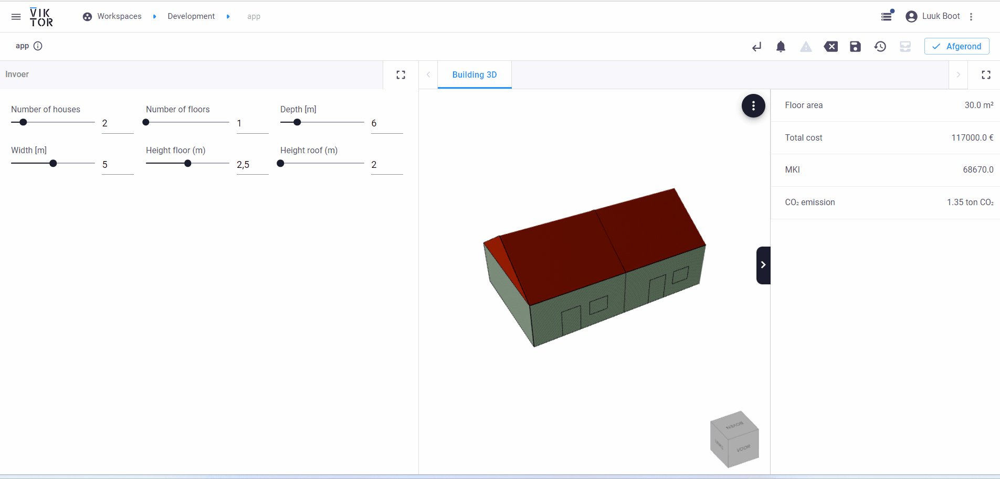

:::note
Estimated time: 30 minutes <br/>
Difficulty level: Beginner
:::

## Introduction 
Welcome to this tutorial on integrating Dynamo with VIKTOR! VIKTOR is a platform dedicated to the Engineering and Construction industry, providing a seamless integration with 3rd party software. In this tutorial, we will explore how to render a basic house with Dynamo and visualize it in VIKTOR. To get started, the user will provide parameters such as the number of houses, width, depth, number of floors, and heights for floors and roofs. The VIKTOR worker will then compute the Dynamo model using the command-line interface included within Dynamo Sandbox. The geometry of the model is generated using either Autodesk Revit or FormIt. The geometry JSON is then converted to a mesh, which is rendered and visualized in VIKTOR. In this tutorial, we will cover the step-by-step process of setting up a VIKTOR app with Dynamo integration we will cover:

Step 1. [Set up a VIKTOR app with Dynamo integration](#1-creating-a-simple-template)

Step 2. [Setting up worker](#2-fill-the-template-with-data)

By the end of this tutorial, you will have created a simple VIKTOR application that creates a geometry and data view of a simple house, see GIF below:



So, let's get started and learn how to create amazing 3D models in Viktor using Python!

:::Tip
You can find the complete code [below](#All-code-together:)
:::

## Pre-requisites

:::note Prerequisites
- You completed [Create your first app](/docs/getting-started/create-first-app) section.
- You have some experience with reading Python code
- You have downloaded the dynamo file
:::

During the tutorial, we added some links to additional information; but don't let them distract you too much. Stay
focused on completing the tutorial. After this, you will know everything you need to create an app which includes integrating with Dynamo.


## 1. Setup a VIKTOR app 

## Create an empty app

Let’s first create and start an empty app. If you don't remember how this worked you can check out the first few steps 
of the [Create your first app](/docs/getting-started/create-first-app) tutorial. Make sure to give you app a recognisable 
name, like "3d-models-tutorial".

Here a short summary of the process.

 ```bash
# Create an empty editor-type app
> viktor-cli create-app my-dynamo-app --app-type editor
# Navigate to the app directory and install the app
> cd my-dynamo-app
> viktor-cli install
# Clear your database just to be sure
> viktor-cli clear
# And start the app!
> viktor-cli start
 ```

:::caution
Please be aware that the `create-app` function sets the newly created app to use the latest [SDK-version](/docs/create-apps/fundamentals/upgrade-viktor-version)
While this tutorial was written using SDK version 14.0.0.
:::

## Add inputfields 
We will add 6 inputfields to our app: `number_of_houses`, `number_of_floors`, `depth`, `width`, `height_floor` and `height_roof`. We will use [Numberfield]( /sdk/api/parametrization?_highlight=numberfield#_NumberField),  for this.

1. Open `app.py`, and add the relavant field to your parametrization. If you like you could accompany the fields with some instructive text. Don't forget to import the necessary fields. In the end your `app.py` file should look like this:


```python showLineNumbers
from viktor import ViktorController
from viktor.parametrization import ViktorParametrization
from viktor.parametrization import NumberField
from viktor.parametrization import Text

class Parametrization(ViktorParametrization):
    intro = Text("# 3D  Dynamo app \n This app parametrically generates and visualises a 3D model of a house using a Dynamo script. \n\n Please fill in the following parameters:")
    
    # Input fields
    number_of_houses = NumberField("Number of houses", max=8.0, min=1.0, variant='slider', step=1.0, default=3.0)
    number_of_floors = NumberField("Number of floors", max=5.0, min=1.0, variant='slider', step=1.0, default=2.0)
    depth = NumberField("Depth [m]", max=10.0, min=5.0, variant='slider', step=1.0, default=8.0)
    width = NumberField("Width [m]", max=6.0, min=4.0, variant='slider', step=1.0, default=5.0)
    height_floor = NumberField("Height floor", max=3.0, min=2.0, variant='slider', step=0.1, default=2.5, suffix='m')
    height_roof = NumberField("Height roof", max=3.0, min=2.0, variant='slider', step=0.1, default=2.5, suffix='m')


class Controller(ViktorController):
    label = 'My Entity Type'
    parametrization = Parametrization
```

2.  Refresh your app, and you should see the input fields there.

## 2. Create a method to update dynamo file 
In this chapter,  we will define the code to take the parameters as input, update the dynamo file, and return the updated files. This will be done by creating a `staticmethod`  in the `controller` class, similar to what is described in the [Generic integration](https://docs.VIKTOR.ai/docs/create-apps/software-integrations/dynamo) section of the VIKTOR documentation.


The following code will update the nodes of the dynamo file and generate an input file with the parameters from the parametrization class:

```python showLineNumbers

@staticmethod
def update_model(params) -> Tuple[File, DynamoFile]:
    """This method updates the nodes of the dynamo file with the parameters
    from the parametrization class."""

    # First the path to the dynamo file is specified and loaded
    file_path = Path(__file__).parent / "dynamo_model_sample_app.dyn"
    _file = File.from_path(file_path)
    dyn_file = DynamoFile(_file)

    # Update dynamo file with parameters from user input
    dyn_file.update("Number of houses", params.number_of_houses)
    dyn_file.update("Number of floors", params.number_of_floors)
    dyn_file.update("Depth", params.depth)
    dyn_file.update("Width", params.width)
    dyn_file.update("Height floor", params.height_floor)
    dyn_file.update("Height roof", params.height_roof)

    # generate updated file
    input_file = dyn_file.generate()

    return input_file, dyn_file
```
Let us go through the above mentioned logic:
1. Retrieve the input files for the analysis, in this case the `dynamo_model_sample_app.dyn` file, and create a DynamoFile object instantiated from the `dynamo_model_sample_app.dyn` file.
2. With the update method, the value of input nodes can be updated.
3. When all inputs have been updated as desired, the generate method can be used to generate an updated [File](/sdk/api/core?_highlight=file#_File) object.

:::Note
To create this geometry you will have to import different functions. See code below:

```python showLineNumbers
from pathlib import Path
from VIKTOR import File
from VIKTOR.external.dynamo import DynamoFile
```
:::


## 2. Create a GeometryView with mocked ouput files

In this chapter we will create a [GeometryView](/sdk/api/views?_highlight=geometr#_GeometryView) to display the house. We will use a mocked output file for now, click [here] to download the json file. In chapter ... we will create the json file using the dynamo script. 

To visualize the mocked output add a `GeometryView` method to your `controller` class, see code below:


```python showLineNumbers


```