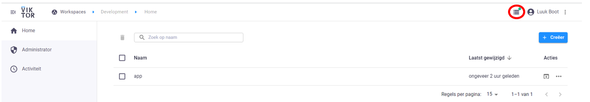

# Tuturial dynamo 
Welcome to this tutorial on setting up an integration with Dynamo within a VIKTOR app. The VIKTOR platform is a dedicated to being a platform for the Engineering and Construction industry, and integrating with 3rd party software is an important aspect that the VIKTOR platform facilitates in. In this tutorial, we will render a basic house, with Dynamo. 

To start, the user provides the necessary parameters these parameters are given in the table below:
| Parameter  | User input |
| ------------- | ------------- |
| Number of houses | {{n_houses}}  |
| Width  | {{width}}  |
| Depth | {{depth}}  |
| Number of floors  | {{n_floors}}  |
| Height floor  | {{height_floor}}  |
| Height roof  | {{height_roof}}  |

. The Viktor worker then computes the dynamo model using the command-line interface included within Dynamo Sandbox. The geometry of the model is generated using either Autodesk Revit or FormIt. The geometry JSON is then converted to a mesh, which is rendered and visualized in Viktor. In this tuturial we will cover:

1. [Set up a VIKTOR app with Dynamo integration](#1-creating-a-simple-template)
2. [Filling the template with data](#2-fill-the-template-with-data)
3. [Display the report in the app](#3-generate-pdf-view)
4. [Download the report](#4-adding-a-download-button)


## Pre-requisites

:::note Prerequisites
- You completed [Create your first app](/docs/getting-started/create-first-app) section.
- You have some experience with reading Python code
:::

During the tutorial, we added some links to additional information; but don't let them distract you too much. Stay
focused on completing the tutorial. After this, you will know everything you need to create an app which includes Dynamo integration.


## Step 1: Set up a VIKTOR app with Dynamo integration

## Step 1.1 Set up the VIKTOR app structure 
Let us assume that you have not yet set up a VIKTOR app yet. To set up a new project, use the following command in 
the terminal:

```
viktor-cli create-app my-Dynamo-app
```

This will set up a project/directory with the starting code needed to create a VIKTOR app.

In the `app.py` file, you will see the following code:

```python
from viktor import ViktorController
from viktor.parametrization import ViktorParametrization
class Parametrization(ViktorParametrization):
class Controller(ViktorController):
    label = 'My Entity Type'
    parametrization = Parametrization
```

As explained in VIKTOR documentation, the `Parametrization` class is used to define all input parameters you will 
find on the left-hand side of the VIKTOR application editor, and the `Controller` class is used define all logic of 
the application editor.

### Step 1.2 Define the input fields
The dynamo file has got the following input paramaters.

| Parameter  | User input |
| ------------- | ------------- |
| Number of houses | {{n_houses}}  |
| Width  | {{width}}  |
| Depth | {{depth}}  |
| Number of floors  | {{n_floors}}  |
| Height floor  | {{height_floor}}  |
| Height roof  | {{height_roof}}  |


We will use the numberfields to dynamically change those parameters. This is how it 
will look like in the `Parametrization` class:

```python
...
from viktor.parametrization import ViktorParametrization, NumberField
class Parametrization(ViktorParametrization):
    # Input fields
    number_of_houses = NumberField("Number of houses", max=8.0, min=1.0, variant='slider', step=1.0, default=3.0)
    number_of_floors = NumberField("Number of floors", max=5.0, min=1.0, variant='slider', step=1.0, default=2.0)
    depth = NumberField("Depth [m]", max=10.0, min=5.0, variant='slider', step=1.0, default=8.0)
    width = NumberField("Width [m]", max=6.0, min=4.0, variant='slider', step=1.0, default=5.0)
    height_floor = NumberField("Height floor", max=3.0, min=2.0, variant='slider', step=0.1, default=2.5, suffix='m')
    height_roof = NumberField("Height roof", max=3.0, min=2.0, variant='slider', step=0.1, default=2.5, suffix='m')
```

### Step 1.3 Define the app logic to update the dynamo file
In this step, we will be defining some code to take the params as input, update the dynamofile and return the updated input_file and dyn_file, which are used to run the analyses. For this, we will be defining code similar to what is described in the 
[Generic integration](https://docs.viktor.ai/docs/create-apps/software-integrations/dynamo) section of the VIKTOR 
documentation. 

We will be creating a `staticmethod` in the `Controller` class, for this:

```python
from pathlib import Path
from viktor import File
from viktor.external.dynamo import DynamoFile

@staticmethod
def update_model(params) -> Tuple[File, DynamoFile]:
    """This method updates the nodes of the dynamo file with the parameters
    from the parametrization class."""

    # First the path to the dynamo file is specified and loaded
    file_path = Path(__file__).parent / "dynamo_model_sample_app.dyn"
    _file = File.from_path(file_path)
    dyn_file = DynamoFile(_file)

    # Update dynamo file with parameters from user input
    dyn_file.update("Number of houses", params.number_of_houses)
    dyn_file.update("Number of floors", params.number_of_floors)
    dyn_file.update("Depth", params.depth)
    dyn_file.update("Width", params.width)
    dyn_file.update("Height floor", params.height_floor)
    dyn_file.update("Height roof", params.height_roof)

    # generate updated file
    input_file = dyn_file.generate()

    return input_file, dyn_file
```
Let us go through the above mentioned logic:
1. Retrieve the input files for the analysis, in this case the `dynamo_model_sample_app.dyn` and create a Dynamo file instantiated from the `dynamo_model_sample_app.dyn` file.
2. With the update method, the value of input nodes can be update
3. When all inputs have been updated as desired, the generate method can be used to generate an updated File object.

### Step 1.4 Define the app logic to convert the output.xml to a data_group
In this step, we will be defining some code to take the Dynamofile and the output.xml file  as input. The dynamofile is used to get the node id ant eh output.xml file is used to get the values.
```python
from pathlib import Path
from viktor import File
from viktor.external.dynamo import DynamoFile

@staticmethod
def convert_dynamo_file_to_data_items(input_file: DynamoFile, output_file: File) -> DataGroup:
    """Extracts the output of the Dynamo results by using the input and output files."""
    # Collect ids for the computational output from the dynamo file (numerical output)
    output_id_floor_area = input_file.get_node_id("(OUTPUT) Floor area per house")
    output_id_total_cost = input_file.get_node_id("(OUTPUT) Total cost")
    output_id_mki = input_file.get_node_id("(OUTPUT) MKI")
    output_id_co2 = input_file.get_node_id("(OUTPUT) CO2")

    # Collect the numerical results from the output file using the collected ids
    with output_file.open_binary() as f:
        floor_area = get_dynamo_result(f, id_=output_id_floor_area)
        total_cost = get_dynamo_result(f, id_=output_id_total_cost)
        mki = get_dynamo_result(f, id_=output_id_mki)
        co2 = get_dynamo_result(f, id_=output_id_co2)

    # Add values to a structured data group
    data_group = DataGroup(
        DataItem(label="Floor area", value=round(float(floor_area), 2), suffix="m²"),
        DataItem(label="Total cost", value=round(float(total_cost), 2), suffix="€"),
        DataItem(label="MKI", value=round(float(mki), 2)),
        DataItem(label="CO₂ emission", value=round(float(co2), 2), suffix="ton CO₂"),
    )
    return data_group
```
Let us go through the above mentioned logic:
1. Get the node_id, which corresponds to the same node id as the input file.
2. Collect the numerical results.
3. Create from this numberical results a data_group, see `DataGroup` on how to create a datagroup.

### Step 3.5 generate a geometry and data view
We create a new `GeometryAndDataView` method insdie the `controller` class. With this mtehod it is possible to show the 3d model of the house and the data. See code belowL

```python
from viktor.external.dynamo import convert_geometry_to_glb
from viktor.views import GeometryView, GeometryResult

@GeometryAndDataView("Building 3D", duration_guess=5)
def geometry_and_data_view(self, params, **kwargs):
    """The endpoint that initiates the logic to visualize the geometry and data executed
    and retrieved from a Dynamo script."""
    # Step 1: Update model
    input_file, dynamo_file = self.update_model(params)

    # Step 2: Running analyses
    files = [
        ('input.dyn', input_file),
    ]

    generic_analysis = GenericAnalysis(files=files, executable_key="dynamo",
                                        output_filenames=["output.xml", "geometry.json"])
    generic_analysis.execute(timeout=60)

    # Step 3: Processing geometry
    geometry_file = generic_analysis.get_output_file('geometry.json', as_file=True)
    glb_file = convert_geometry_to_glb(geometry_file)

    # Step 4: Process numerical output
    output_file = generic_analysis.get_output_file('output.xml', as_file=True)
    data_group = self.convert_dynamo_file_to_data_items(dynamo_file, output_file)

    return GeometryAndDataResult(geometry=glb_file, data=data_group)
```
Let us go through the above mentioned logic:
1. Update the dynamo file with the `update_model` method(see step 3.3)
2. Running the analysis with the `GenericAnalysis` class. The executable_key in the example above refers to the "dynamo" command. This command should also be specified in the configuration file on the server, located in the same directory as the worker. See step 4..
3. Processing the geometry, the .json file can be obtained with the `get_ouput_file` . method. With the helper function `convert_geometry_to_glb`, you can convert it to a GLB type file, which can directly be visualized in a `GeometryAndDataView`.
4. Processing geometry, the .xml file can be obtained with the `get_ouput_file` . method. With the static method `convert_dynamo_file_to_data_items`, you can convert the .xml file to a datagroup, which can be directely visualized in `GeometryAndDataView`.


## Step 3 Setting up worker 
A worker is a program that connects VIKTOR with third-party software to execute tasks and retrieve results through the platform.  The worker communicates with the VIKTOR cloud via an encrypted  connection, eliminating the need to open public ports on the network. For Dynamo integration, the generic worker must be installed. 

## Step 3.1 Install worker 

Follow the steps below, to install the worker:

1. Select the generic worker. The installer starts an installation wizard from which the worker can be configured. Administrator rights on the machine are required to perform the installation.

2. Specification of the installation directory. The standard directory that is used for the installation is: C:\Program Files\Viktor\Viktor for 

```
C:\Program Files\Viktor\Viktor for <application> <software package> <version>
```
3. Configuration of the worker. Using the installation wizard you will be asked to fill the required information step-by-step. During this installation wizard you are asked for your  credentials 

4. For the credentials follow the steps that are shown in the picture below:


$\qquad$ 4.1 Go to workers tab 

$\qquad$ 4.2 Press the button "Create worker" (top right)

$\qquad$ 4.3 Fill in the description, allocation to specific and use your workspace  

$\qquad$ 4.4 Press on create, you will get the following pop up(see figure below). Paste the credential code and placed in it in the install wizard immediately. Viktor will not preserve this data for security reasons.


## Step 3.2 Setup worker
To setup the worker first formit needs to be installed [Download link](https://formit.autodesk.com/)
After it is installed we will set up the worker to execute the logic when the input files have been sent by the VIKTOR app. The setup of the worker is defined in the config.yaml file, which can be found in the same folder where the worker is installed. Edit the config.yaml file as follows:

```
<pre><code>executables:
  dynamo:
    path: 'C:\Program Files\Autodesk\FormIt\DynamoSandbox\DynamoWPFCLI.exe'
    arguments:
    - '-o'
    - 'input.dyn'
    - '-v'
    - 'output.xml'
    - '-gp'
    - 'C:\Program Files\Autodesk\FormIt' 
    - '-g'
    - 'geometry.json'
maxParallelProcesses: 1 # must be one, please do not change
</code></pre>
```
- `path`: Here we define the path of the program to be executed.
- `arguments`: Under this key we can list all arguments that can be added to the executable. This works similar to 
- `-o` Open the dynamo script(input.dyn)
- `-v` Ouput geometry file (name = output.xml)
- `-gp` Path to local installation of Autodesk FormIt or Revit
- `-g` Output Json geometry file

For more information about the Dynamo CLI is referred to: https://github.com/DynamoDS/Dynamo/wiki/Dynamo-Command-Line-Interface

## Step 3.3 Start up worker 
Once you have saved your `config.yaml` file, you can run **viktor-worker-gneric**  file. Be sure to run the file with Administrator rights. If all went well, you will be presented in the worker terminal with the message: "Successfully connected to the server". Also in in top right corner you should see a green bullet, see figure below.





## 5. All code together

```python showLineNumbers
from typing import Tuple

from viktor import ViktorController
from viktor.parametrization import ViktorParametrization, NumberField
from viktor.views import GeometryAndDataView, GeometryAndDataResult, DataItem, DataGroup
from viktor.external.generic import GenericAnalysis
from viktor.external.dynamo import DynamoFile, convert_geometry_to_glb, get_dynamo_result
from viktor.core import File
from pathlib import Path


class Parametrization(ViktorParametrization):
    # Input fields
    number_of_houses = NumberField("Number of houses", max=8.0, min=1.0, variant='slider', step=1.0, default=3.0)
    number_of_floors = NumberField("Number of floors", max=5.0, min=1.0, variant='slider', step=1.0, default=2.0)
    depth = NumberField("Depth [m]", max=10.0, min=5.0, variant='slider', step=1.0, default=8.0)
    width = NumberField("Width [m]", max=6.0, min=4.0, variant='slider', step=1.0, default=5.0)
    height_floor = NumberField("Height floor", max=3.0, min=2.0, variant='slider', step=0.1, default=2.5, suffix='m')
    height_roof = NumberField("Height roof", max=3.0, min=2.0, variant='slider', step=0.1, default=2.5, suffix='m')


class Controller(ViktorController):
    viktor_enforce_field_constraints = True  # Resolves upgrade instruction https://docs.viktor.ai/sdk/upgrades#U83

    label = 'Residential Block'
    parametrization = Parametrization

    @staticmethod
    def update_model(params) -> Tuple[File, DynamoFile]:
        """This method updates the nodes of the dynamo file with the parameters
        from the parametrization class."""

        # First the path to the dynamo file is specified and loaded
        file_path = Path(__file__).parent / "dynamo_model_sample_app.dyn"
        _file = File.from_path(file_path)
        dyn_file = DynamoFile(_file)

        # Update dynamo file with parameters from user input
        dyn_file.update("Number of houses", params.number_of_houses)
        dyn_file.update("Number of floors", params.number_of_floors)
        dyn_file.update("Depth", params.depth)
        dyn_file.update("Width", params.width)
        dyn_file.update("Height floor", params.height_floor)
        dyn_file.update("Height roof", params.height_roof)

        # generate updated file
        input_file = dyn_file.generate()

        return input_file, dyn_file

    @GeometryAndDataView("Building 3D", duration_guess=5)
    def geometry_and_data_view(self, params, **kwargs):
        """The endpoint that initiates the logic to visualize the geometry and data executed
        and retrieved from a Dynamo script."""
        # Step 1: Update model
        input_file, dynamo_file = self.update_model(params)

        # Step 2: Running analyses
        files = [
            ('input.dyn', input_file),
        ]

        generic_analysis = GenericAnalysis(files=files, executable_key="dynamo",
                                           output_filenames=["output.xml", "geometry.json"])
        generic_analysis.execute(timeout=60)

        # Step 3: Processing geometry
        geometry_file = generic_analysis.get_output_file('geometry.json', as_file=True)
        glb_file = convert_geometry_to_glb(geometry_file)

        # Step 4: Process numerical output
        output_file = generic_analysis.get_output_file('output.xml', as_file=True)
        data_group = self.convert_dynamo_file_to_data_items(dynamo_file, output_file)

        return GeometryAndDataResult(geometry=glb_file, data=data_group)

    @staticmethod
    def convert_dynamo_file_to_data_items(input_file: DynamoFile, output_file: File) -> DataGroup:
        """Extracts the output of the Dynamo results by using the input and output files."""
        # Collect ids for the computational output from the dynamo file (numerical output)
        output_id_floor_area = input_file.get_node_id("(OUTPUT) Floor area per house")
        output_id_total_cost = input_file.get_node_id("(OUTPUT) Total cost")
        output_id_mki = input_file.get_node_id("(OUTPUT) MKI")
        output_id_co2 = input_file.get_node_id("(OUTPUT) CO2")

        # Collect the numerical results from the output file using the collected ids
        with output_file.open_binary() as f:
            floor_area = get_dynamo_result(f, id_=output_id_floor_area)
            total_cost = get_dynamo_result(f, id_=output_id_total_cost)
            mki = get_dynamo_result(f, id_=output_id_mki)
            co2 = get_dynamo_result(f, id_=output_id_co2)

        # Add values to a structured data group
        data_group = DataGroup(
            DataItem(label="Floor area", value=round(float(floor_area), 2), suffix="m²"),
            DataItem(label="Total cost", value=round(float(total_cost), 2), suffix="€"),
            DataItem(label="MKI", value=round(float(mki), 2)),
            DataItem(label="CO₂ emission", value=round(float(co2), 2), suffix="ton CO₂"),
        )
        return data_group

```

## To infinity and beyond!

Nice! You are now able to create an app that takes in user input and processes this automatically into a report which is 
shown as a `PDFView` and can be downloaded as a Word file!

Of course, the journey doesn't end here. Check out some of our other [tutorials](/docs/getting-started/tutorials/)
or go to the [next section](/docs/create-apps/) where you can see the different paths you can fol;low in your journey to 
learn more about VIKTOR. 
